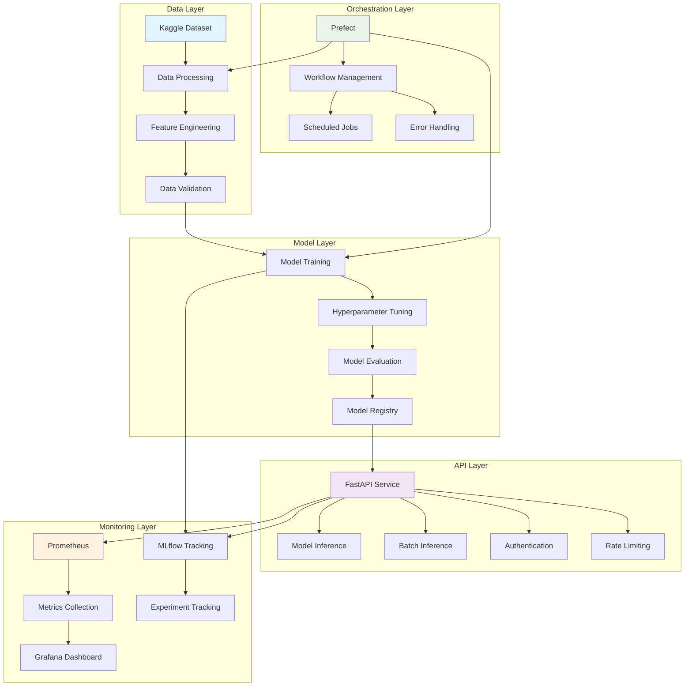

# News Classification MLOps

> **Production-Ready MLOps Pipeline for News Classification**

An end-to-end MLOps pipeline demonstrating best practices in machine learning operations, from data ingestion to model deployment and monitoring.

## Overview

This project implements a complete MLOps pipeline for news classification using BBC articles from Kaggle. It showcases industry-standard practices for:

- **Data Pipeline**: Automated data ingestion, preprocessing, and validation
- **Model Training**: Experiment tracking, hyperparameter tuning, and model versioning
- **Model Serving**: RESTful API with authentication, rate limiting, and batch inference
- **Orchestration**: Workflow management with dependency resolution
- **Monitoring**: Real-time metrics, performance tracking, and alerting
- **Testing**: Unit tests, integration tests, and load testing
- **Deployment**: Container-based deployment with Docker and Kubernetes support

## Features

### Complete MLOps Pipeline
- Automated data processing and feature engineering
- Model training with hyperparameter optimization
- Experiment tracking and model registry
- CI/CD pipeline with automated testing

### Production-Ready API
- FastAPI-based REST service with async support
- **Batch prediction endpoint** for processing multiple titles efficiently
- API key authentication with configurable rate limiting (slowapi)
- Model versioning and A/B testing support
- Comprehensive API documentation with Swagger/OpenAPI

### Monitoring and Observability
- Real-time metrics collection with Prometheus
- Interactive dashboards with Grafana
- Model performance monitoring and drift detection
- System health and resource utilization tracking

### Workflow Orchestration
- Prefect-based workflow management
- Dependency resolution and error handling
- Scheduled and event-driven execution
- Flow visualization and debugging

### Comprehensive Testing
- Unit tests for all core components
- Integration tests for API endpoints
- Load testing with Locust
- Model validation and performance testing

### Container-Based Deployment
- Multi-stage Docker builds for optimization
- Docker Compose for local development
- Kubernetes manifests for production deployment
- Environment-specific configurations

### Security Best Practices
- Secure secret management
- API authentication and authorization
- Network policies and access control
- Container security scanning

## Architecture

## Prerequisites

### Required Software
- **Docker**: 20.10+ and **Docker Compose**: 2.0+
- **Python**: 3.10+ (for local development)
- **Git**: For version control

### Optional (for Kubernetes deployment)
- **Kubernetes**: 1.20+ cluster
- **kubectl**: Configured to access your cluster
- **Ingress Controller**: For external access (nginx/traefik)

### Required Accounts
- **Kaggle**: For dataset access
- **GitHub**: For CI/CD (if using GitHub Actions)
- **Container Registry**: Docker Hub, GHCR, or similar

---

## Wiki Navigation

- [Quick Start](Quick-Start) - Get up and running
- [Project Structure](Project-Structure) - Understand the codebase
- [API Reference](API-Reference) - Endpoint documentation
- [Configuration](Configuration) - Environment variables and settings
- [Monitoring](Monitoring) - Grafana, Prometheus, MLflow
- [Testing](Testing) - Test suite documentation
- [Cloud Deployment](Cloud-Deployment) - AWS, GKE, AKS guides
- [Development](Development) - Local development setup
- [Troubleshooting](Troubleshooting) - Common issues and solutions
